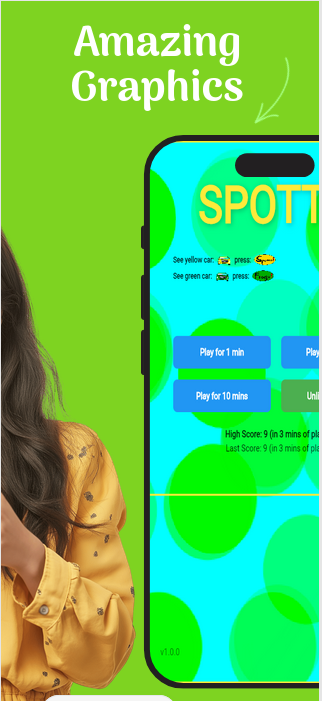
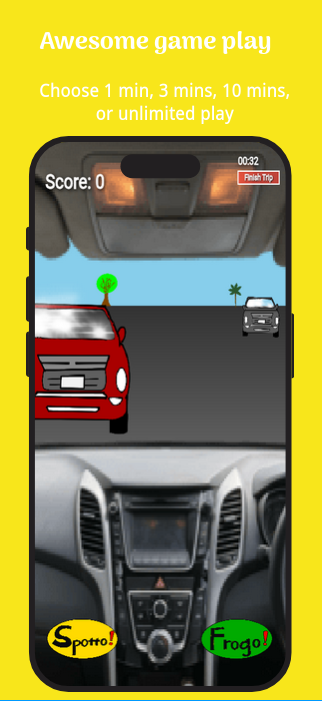
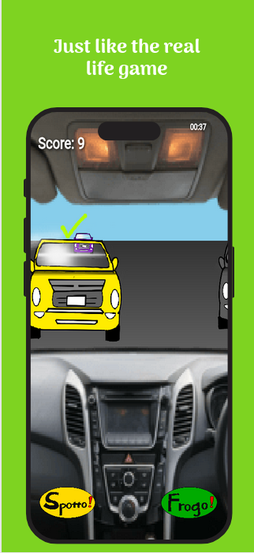
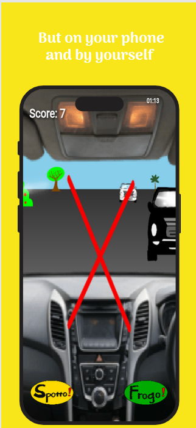
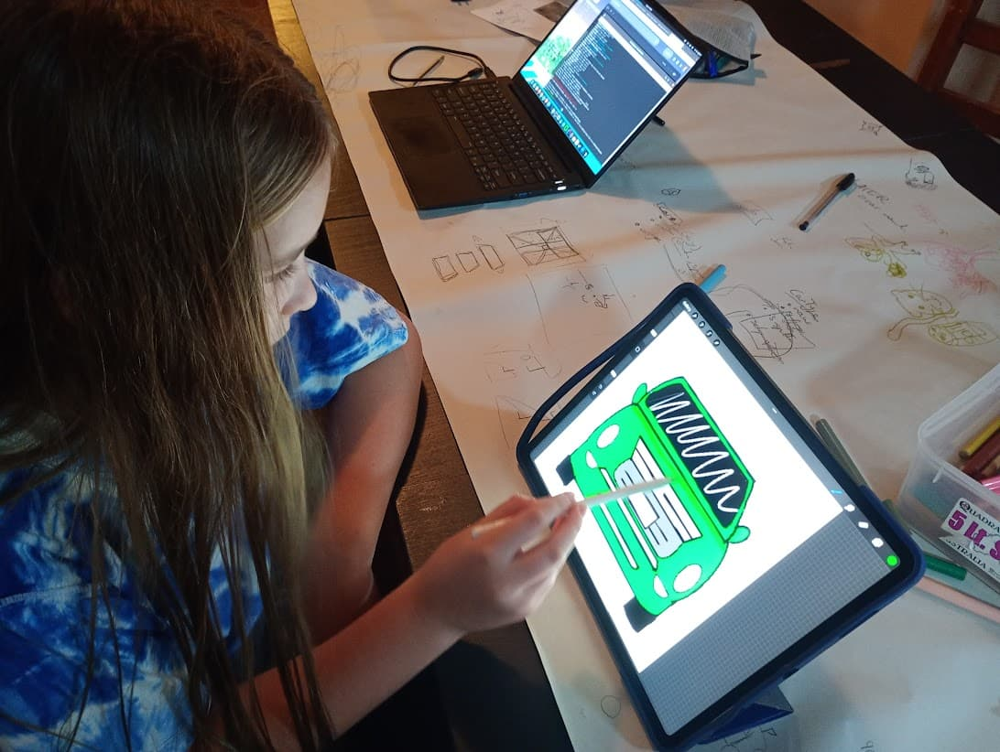

# Spotto

The family car game of "Spotto" but as a mobile app.

  
  
  
  
  

---

  
   &nbsp; &nbsp; 
  

---

Family car trips just got a whole lot more fun!

The game of Spotto is simple;    
If you see a yellow car, you yell out "Spotto",    
If you see a green car, you yell out Froggo.     

Now you don't need to look out the window to spot real cars, everyone can just look at their device and play the game on there.    
Compare your best scores.    
So much fun.    

Note - the driver of the car should not play the mobile game of "Spotto" while driving, only passengers.

---

We made a simple game with Flutter/Flame, as a family, in a weekend.

---

